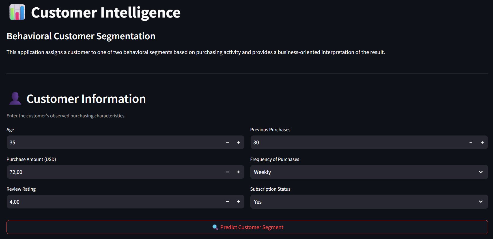
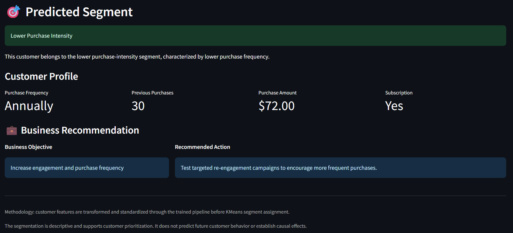
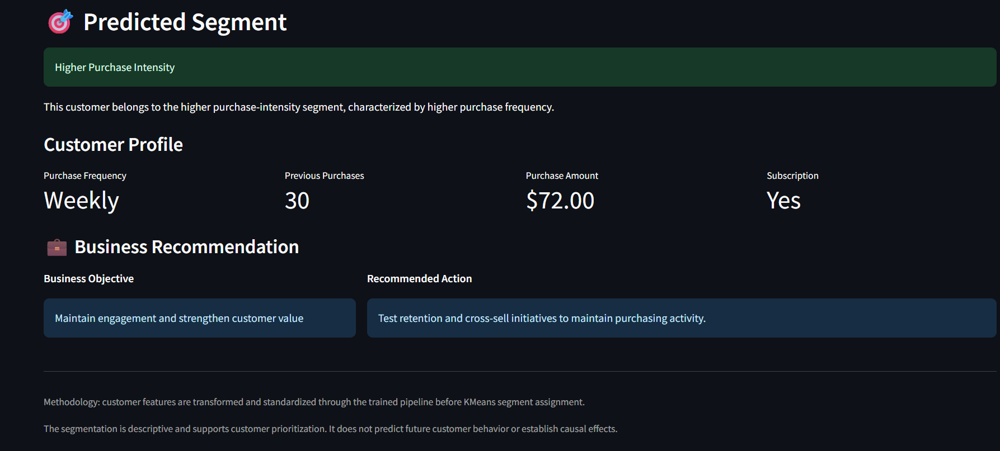

# Customer Intelligence & Behavioral Segmentation

An end-to-end data science project for discovering behavioral customer segments using unsupervised machine learning, advanced feature engineering, clustering validation, business profiling, and a production-oriented customer assignment pipeline.

The project transforms raw customer data into **behavioral intelligence** that can support customer prioritization and targeted engagement strategies.

---

## Project Overview

Understanding customers requires more than descriptive statistics. This project explores whether customer purchasing behavior can be transformed into meaningful and stable behavioral segments using unsupervised machine learning.

The analysis follows an end-to-end Data Science workflow:

**Data Audit → Feature Engineering → Segmentation → Validation → Customer Profiling → Business Value Analysis → Actionability → Customer Assignment → Dashboard**

The final system provides two complementary outputs:

* an analytical framework for understanding customer behavior
* a reusable machine learning pipeline capable of assigning a new customer to an existing behavioral segment
## Application Preview

### Streamlit Interface



### Lower Purchase Intensity



### Higher Purchase Intensity


---
## Project Highlights

- **3,900 customers** analyzed through behavioral customer segmentation
- **2 behavioral segments** identified based primarily on purchase intensity
- **Silhouette Score ≈ 0.212** with highly stable clustering across random seeds
- Compared **KMeans, Gaussian Mixture Models, and DBSCAN**
- Built a reusable **scikit-learn pipeline** for new customer segment assignment
- Developed a **Streamlit decision-support application** for customer intelligence
- Translated unsupervised learning results into **business-oriented customer actions**
- Followed a complete workflow from **data audit → modeling → validation → business interpretation → deployment**

## Business Problem

A company may have customer-level information such as:

* purchase amount
* purchase frequency
* previous purchases
* subscription status
* customer age
* review ratings

However, these variables do not directly provide a behavioral segmentation strategy.

The objective of this project is therefore to answer:

> **Can customers be grouped into stable behavioral segments based on their observed purchasing activity?**

And, if meaningful segments exist:

> **Can a new customer be consistently assigned to one of these segments for business prioritization?**

---

## Objectives

### Analytical objectives

* Audit and understand the customer dataset
* Engineer meaningful behavioral features
* Identify customer groups using unsupervised learning
* Compare alternative clustering approaches
* Validate cluster stability and robustness
* Profile the resulting customer segments
* Translate analytical findings into business-oriented actions

### Technical objectives

* Build a reproducible feature transformation pipeline
* Standardize features before clustering
* Persist the trained preprocessing and clustering model
* Assign new customers to existing segments
* Provide an interactive Streamlit interface

---

## Dataset

The project uses the **Shopping Trends** customer dataset.

The dataset contains:

* **3,900 customers**
* **19 original features**
* one customer-level observation per row
* no missing values
* no duplicate records
* unique customer identifiers

The original dataset contains demographic, purchasing, subscription, promotion, payment, and purchase-frequency information.

### Important dataset limitation

This dataset does **not** contain transaction-level order history or timestamps.

Therefore, this project does not claim to perform:

* true Market Basket Analysis
* longitudinal customer lifetime value estimation
* churn prediction
* causal analysis
* future purchase prediction

The analysis is intentionally focused on **descriptive behavioral segmentation**.

---

## Methodology

### 1. Data Audit

The initial audit verifies:

* dataset dimensions
* data types
* missing values
* duplicates
* customer identifier uniqueness
* categorical distributions
* numerical distributions
* correlations between numerical variables

The audit revealed a clean customer-level dataset with no missing values or duplicate records.

---

### 2. Behavioral Feature Engineering

Rather than clustering directly on raw categorical variables, the project constructs behavioral features representing purchasing intensity.

The initial numerical features include:

* Age
* Purchase Amount
* Review Rating
* Previous Purchases

Purchase frequency is converted into an annualized numerical scale:

| Frequency      | Annualized value |
| -------------- | ---------------: |
| Weekly         |               52 |
| Bi-Weekly      |               26 |
| Fortnightly    |               26 |
| Monthly        |               12 |
| Quarterly      |                4 |
| Every 3 Months |                4 |
| Annually       |                1 |

Additional binary features:

* Subscription status
* Discount usage
* Promotional code usage

Derived behavioral features include:

* Estimated Annual Spend
* Purchase Engagement
* Promotion Engagement

Log transformations are then applied to the highly right-skewed derived behavioral measures.

---

## Final Clustering Features

The final model uses eight features:

```text
Age
Purchase Amount (USD)
Review Rating
Previous Purchases
Purchase Frequency
Is_Subscribed
Log_Annual_Spend
Log_Purchase_Engagement
```

Highly redundant features were excluded from the final model.

In particular, discount usage and promotional-code usage were found to be perfectly correlated in this dataset, so they were not retained as separate clustering dimensions.

---

## 3. Feature Scaling

Because the clustering algorithm is distance-based, the final features are standardized using `StandardScaler`.

The transformation is integrated into the production pipeline rather than being manually reproduced when assigning new customers.

---

## 4. Customer Segmentation

Several clustering configurations were evaluated.

### K-Means

K-Means was evaluated for multiple values of `k`.

The strongest Silhouette Score was obtained with:

```text
k = 2
Silhouette Score ≈ 0.212
```

The resulting segmentation contains two approximately balanced groups:

| Segment   | Customers | Share |
| --------- | --------: | ----: |
| Cluster 0 |     1,986 | 50.9% |
| Cluster 1 |     1,914 | 49.1% |

The dominant behavioral difference is **purchase intensity**, particularly purchase frequency.

---

## 5. Alternative Clustering Validation

### Gaussian Mixture Model

A Gaussian Mixture Model with two components produced a very similar result:

```text
Silhouette Score ≈ 0.209
```

This provides additional evidence that the two-group structure is not exclusively an artifact of the K-Means algorithm.

### DBSCAN

DBSCAN was also evaluated.

The best tested configuration produced:

```text
4 clusters
Noise ≈ 0.67%
Silhouette Score ≈ 0.127
```

This was weaker than the K-Means solution.

Therefore, K-Means with two clusters was retained as the reference segmentation.

---

## 6. Segmentation Stability

The segmentation was not selected solely from one clustering run.

The K-Means solution was evaluated across multiple random seeds and subsamples.

The results showed:

* highly consistent Silhouette Scores
* Adjusted Rand Index values close to 1 across random seeds
* strong agreement between the reference solution and subsampled solutions

This indicates that the **two-cluster assignment is highly stable**, even though the actual separation between clusters is moderate.

This distinction is important:

> **The segmentation is stable, but not strongly separated.**

---

## 7. Customer Profiling

The two clusters are not strongly differentiated by demographic or categorical characteristics.

The main difference is behavioral intensity.

### Lower Purchase Intensity

**Cluster 0 — 50.9% of customers**

Typical characteristics:

* lower purchase frequency
* fewer previous purchases
* slightly lower average purchase amount
* similar age distribution
* similar subscription rate
* similar ratings

### Higher Purchase Intensity

**Cluster 1 — 49.1% of customers**

Typical characteristics:

* substantially higher purchase frequency
* more previous purchases
* slightly higher average purchase amount
* similar age distribution
* similar subscription rate
* similar ratings

The segmentation therefore should not be interpreted as demographic personas such as "premium", "loyal", or "VIP" customers.

It is more accurately described as a distinction between:

**Lower Purchase Intensity ↔ Higher Purchase Intensity**

---

## 8. Business Value Analysis

The main observed differences between the segments are:

| Indicator               | Lower Intensity | Higher Intensity |
| ----------------------- | --------------: | ---------------: |
| Average Purchase Amount |           58.44 |            61.14 |
| Previous Purchases      |           23.89 |            26.87 |
| Purchase Frequency      |            4.37 |            31.07 |
| Customers               |           1,986 |            1,914 |

Purchase frequency is by far the strongest differentiating variable.

An annualized spending estimate can be derived from purchase amount × purchase frequency, but it should **not** be interpreted as observed annual revenue or Customer Lifetime Value because the dataset does not contain longitudinal transaction data.

---

## 9. Business Actionability

The segmentation can support:

### Lower Purchase Intensity

**Business objective:**
Increase engagement and purchase frequency.

**Potential actions:**

* test targeted re-engagement campaigns
* encourage more frequent purchasing
* monitor changes in purchase frequency

### Higher Purchase Intensity

**Business objective:**
Maintain engagement and strengthen customer value.

**Potential actions:**

* test retention initiatives
* explore cross-sell opportunities
* prioritize commercial attention
* monitor repeat purchasing behavior

These recommendations are **business hypotheses to test**, not proven causal effects.

---

## 10. Customer Intelligence Pipeline

The project goes beyond exploratory clustering by implementing a reusable customer assignment pipeline.

The production pipeline is:

```text
Raw Customer Data
       ↓
CustomerFeatureTransformer
       ↓
StandardScaler
       ↓
KMeans
       ↓
Customer Segment
```

The custom `CustomerFeatureTransformer` guarantees that a new customer's raw information is transformed using the **same feature engineering logic** used during model training.

The complete pipeline is serialized using `joblib`.

---

## 11. New Customer Assignment

The system can receive a new customer containing:

```text
Age
Purchase Amount
Review Rating
Previous Purchases
Purchase Frequency
Subscription Status
```

The pipeline automatically:

1. constructs the model features
2. applies the same transformations
3. standardizes the features
4. assigns the customer to the closest learned cluster

This allows the existing segmentation to be reused without retraining K-Means for every new customer.

---

## 12. Streamlit Application

A Streamlit application provides an interactive interface for customer segment assignment.

The application displays:

* customer inputs
* predicted behavioral segment
* customer profile
* business objective
* recommended business action
* methodology and model limitations

Run locally with:

```bash
python -m streamlit run app.py
```

The application is designed as a **decision-support prototype**, not as a predictive system for future customer behavior.

---

## 13. Dashboard

The project also contains a dedicated dashboard notebook covering:

* customer segment distribution
* average purchase frequency
* behavioral indicators
* segment-level KPIs
* business interpretation

The dashboard is intended to translate the clustering results into a form that can be understood by non-technical stakeholders.

---

## 14. Project Structure

```text
customer-intelligence-segmentation/
│
├── data/
│   └── shopping_trends.csv          # Not tracked in Git
│
├── models/
│   ├── customer_kmeans.pkl
│   ├── customer_pipeline.pkl
│   └── customer_scaler.pkl
│
├── notebooks/
│   ├── 01_data_audit.ipynb
│   ├── 02_feature_engineering.ipynb
│   ├── 03_segmentation_validation.ipynb
│   ├── 04_Clusters_Profiling.ipynb
│   ├── 05_Business Value Analysis.ipynb
│   ├── 06_Segmentation_Actionability.ipynb
│   ├── 07_customer_intelligence_prototype.ipynb
│   └── 08_dashboard.ipynb
│
├── src/
│   ├── __init__.py
│   └── customer_features.py
│
├── app.py
├── .gitignore
└── README.md
```

Generated datasets and intermediate artifacts are intentionally excluded from version control.

---

## 15. Technologies

### Programming & Data

* Python
* Pandas
* NumPy

### Machine Learning

* Scikit-learn
* K-Means
* Gaussian Mixture Models
* DBSCAN
* PCA
* StandardScaler

### Visualization

* Matplotlib
* Seaborn
* Streamlit

### Model Persistence

* Joblib

### Development

* Jupyter Notebook
* PyCharm / VS Code
* Git
* GitHub

---

## 16. Key Findings

The analysis leads to four main conclusions:

### 1. Two stable behavioral groups emerge

The K-Means solution with two clusters is highly stable across random initializations and subsamples.

### 2. Purchase frequency drives the segmentation

The strongest difference between the two segments is purchase intensity, especially purchase frequency.

### 3. The clusters are not strongly separated

The Silhouette Score of approximately `0.212` indicates that the groups overlap substantially.

The model should therefore be used for **behavioral prioritization**, rather than treating the segments as sharply distinct customer personas.

### 4. The dataset limits the business conclusions

Because the dataset is customer-level rather than transaction-level and lacks longitudinal information, the project cannot establish:

* customer churn
* future purchasing behavior
* true Customer Lifetime Value
* causal relationships
* product association rules

These limitations are explicitly considered in the interpretation.

---

## 17. Limitations

This project intentionally avoids over-interpreting the clustering results.

### Data limitations

* one observation per customer
* no transaction timestamps
* no order-level history
* no observed customer revenue over time
* no product co-purchase information

### Modeling limitations

* moderate cluster separation
* K-Means assumes relatively compact clusters
* behavioral segments are descriptive
* no causal inference
* no future behavior prediction

The results should therefore be considered a **customer intelligence and prioritization framework**, rather than a predictive customer value model.

---

## 18. Potential Future Improvements

With a richer transaction-level dataset, the project could be extended toward:

* Recency-Frequency-Monetary analysis
* cohort analysis
* customer lifetime value modeling
* churn prediction
* customer migration between segments
* product recommendation
* association rule mining
* temporal behavioral modeling
* supervised prediction of future customer outcomes

These extensions require additional data and are intentionally outside the scope of the current dataset.

---

## 19. What This Project Demonstrates

This project demonstrates an end-to-end applied Data Science workflow:

```text
Business Question
       ↓
Data Audit
       ↓
Behavioral Feature Engineering
       ↓
Unsupervised Learning
       ↓
Model Comparison
       ↓
Stability Validation
       ↓
Customer Profiling
       ↓
Business Interpretation
       ↓
Actionability
       ↓
Reusable ML Pipeline
       ↓
Interactive Decision-Support Application
```

The emphasis is not only on obtaining clusters, but on determining **whether those clusters are stable, what they actually represent, and how they can responsibly be used in a business context.**
